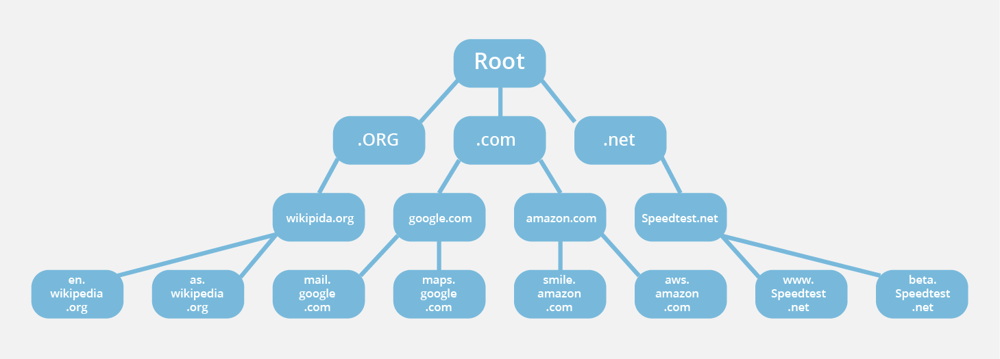

# Internet

## 1. What does the internet work ?

The Internet is the backbone of the Web, the technical infrastructure that makes the Web possible. At its most basic, the Internet is a large network of computers which communicate all together.

It began in the 1960s as a US-army-funded research project, then evolved into a public infrastructure in the 1980s with the support of many public universities and private companies. The various technologies that support the Internet have evolved over time, but the way it works hasn't changed that much: Internet is a way to connect computers all together and ensure that, whatever happens, they find a way to stay connected.

Each computer on a network is connected to a special tiny computer called a router. This router has only one job: like a signaler at a railway station, it makes sure that a message sent from a given computer arrives at the right destination computer. To send a message to computer B, computer A must send the message to the router, which in turn forwards the message to computer B and makes sure the message is not delivered to computer C.

Once we add a router to the system, our network of 10 computers only requires 10 cables: a single plug for each computer and a router with 10 plugs.

So far so good. But what about connecting hundreds, thousands, billions of computers? Of course a single router can't scale that far, but, if you read carefully, we said that a router is a computer like any other, so what keeps us from connecting two routers together?

By connecting computers to routers, then routers to routers, we are able to scale infinitely.

Such a network comes very close to what we call the Internet, but we're missing something. We built that network for our own purposes. There are other networks out there: your friends, your neighbors, anyone can have their own network of computers. But it's not really possible to set cables up between your house and the rest of the world, so how can you handle this? Well, there are already cables linked to your house, for example, electric power and telephone. The telephone infrastructure already connects your house with anyone in the world so it is the perfect wire we need. To connect our network to the telephone infrastructure, we need a special piece of equipment called a modem. This modem turns the information from our network into information manageable by the telephone infrastructure and vice versa.

> https://developer.mozilla.org/en-US/docs/Learn/Common_questions/How_does_the_Internet_work

## 2. What is HTTP ?

HTTP is a protocol which allows the fetching of resources, such as HTML documents. It is the foundation of any data exchange on the Web and it is a client-server protocol, which means requests are initiated by the recipient, usually the Web browser. A complete document is reconstructed from the different sub-documents fetched, for instance text, layout description, images, videos, scripts, and more.

Clients and servers communicate by exchanging individual messages (as opposed to a stream of data). The messages sent by the client, usually a Web browser, are called requests and the messages sent by the server as an answer are called responses.

Designed in the early 1990s, HTTP is an extensible protocol which has evolved over time. It is an application layer protocol that is sent over TCP, or over a TLS-encrypted TCP connection, though any reliable transport protocol could theoretically be used.

Due to its extensibility, it is used to not only fetch hypertext documents, but also images and videos or to post content to servers, like with HTML form results. HTTP can also be used to fetch parts of documents to update Web pages on demand.

HTTP is generally designed to be simple and human readable, even with the added complexity introduced in HTTP/2 by encapsulating HTTP messages into frames. HTTP messages can be read and understood by humans, providing easier testing for developers, and reduced complexity for newcomers.

**Web Server;**

On the opposite side of the communication channel, is the server, which serves the document as requested by the client. A server appears as only a single machine virtually: this is because it may actually be a collection of servers, sharing the load (load balancing) or a complex piece of software interrogating other computers (like cache, a DB server, or e-commerce servers), totally or partially generating the document on demand.

**Proxies;**

Between the Web browser and the server, numerous computers and machines relay the HTTP messages. Due to the layered structure of the Web stack, most of these operate at the transport, network or physical levels, becoming transparent at the HTTP layer and potentially making a significant impact on performance. Those operating at the application layers are generally called proxies. These can be transparent, forwarding on the requests they receive without altering them in any way, or non-transparent, in which case they will change the request in some way before passing it along to the server. Proxies may perform numerous functions:

- caching (the cache can be public or private, like the browser cache)
- filtering (like an antivirus scan or parental controls)
- load balancing (to allow multiple servers to serve the different requests)
- authentication (to control access to different resources)
- logging (allowing the storage of historical information)

> https://developer.mozilla.org/en-US/docs/Web/HTTP/Overview

## 3. How does a web browser work?

A web browser takes you anywhere on the internet. It retrieves information from other parts of the web and displays it on your desktop or mobile device. The information is transferred using the Hypertext Transfer Protocol, which defines how text, images and video are transmitted on the web. This information needs to be shared and displayed in a consistent format so that people using any browser, anywhere in the world can see the information.

Sadly, not all browser makers choose to interpret the format in the same way. For users, this means that a website can look and function differently. Creating consistency between browsers, so that any user can enjoy the internet, regardless of the browser they choose, is called web standards.

When the web browser fetches data from an internet connected server, it uses a piece of software called a rendering engine to translate that data into text and images. This data is written in Hypertext Markup Language (HTML) and web browsers read this code to create what we see, hear and experience on the internet.

Hyperlinks allow users to follow a path to other pages or sites on the web. Every webpage, image and video has its own unique Uniform Resource Locator (URL), which is also known as a web address. When a browser visits a server for data, the web address tells the browser where to look for each item that is described in the html, which then tells the browser where it goes on the web page.

**Cookies;**

Websites save information about you in files called cookies. They are saved on your computer for the next time you visit that site. Upon your return, the website code will read that file to see that it’s you. For example, when you go to a website, the page remembers your username and password – that’s made possible by a cookie.

There are also cookies that remember more detailed information about you. Perhaps your interests, your web browsing patterns, etc. This means that a site can provide you more targeted content – often in the form of ads. There are types of cookies, called third-party cookies, that come from sites you’re not even visiting at the time and can track you from site to site to gather information about you, which is sometimes sold to other companies. Sometimes you can block these kinds of cookies, though not all browsers allow you to.

> https://www.mozilla.org/en-US/firefox/browsers/what-is-a-browser/#:~:text=How%20does%20a%20web%20browser,are%20transmitted%20on%20the%20web.

## 4. DNS and how it works

The Domain Name System (DNS) is the phonebook of the Internet. Humans access information online through domain names, like nytimes.com or espn.com. Web browsers interact through Internet Protocol (IP) addresses. DNS translates domain names to IP addresses so browsers can load Internet resources.

Each device connected to the Internet has a unique IP address which other machines use to find the device. DNS servers eliminate the need for humans to memorize IP addresses such as 192.168.1.1 (in IPv4), or more complex newer alphanumeric IP addresses such as 2400:cb00:2048:1::c629:d7a2 (in IPv6).

The process of DNS resolution involves converting a hostname (such as www.example.com) into a computer-friendly IP address (such as 192.168.1.1). An IP address is given to each device on the Internet, and that address is necessary to find the appropriate Internet device - like a street address is used to find a particular home. When a user wants to load a webpage, a translation must occur between what a user types into their web browser (example.com) and the machine-friendly address necessary to locate the example.com webpage.

In order to understand the process behind the DNS resolution, it’s important to learn about the different hardware components a DNS query must pass between. For the web browser, the DNS lookup occurs “ behind the scenes” and requires no interaction from the user’s computer apart from the initial request.

**DNS recursor;**

The recursor can be thought of as a librarian who is asked to go find a particular book somewhere in a library. The DNS recursor is a server designed to receive queries from client machines through applications such as web browsers. Typically the recursor is then responsible for making additional requests in order to satisfy the client’s DNS query.

**Root nameserver;**

The root server is the first step in translating (resolving) human readable host names into IP addresses. It can be thought of like an index in a library that points to different racks of books - typically it serves as a reference to other more specific locations.

**TLD nameserver;**

The top level domain server (TLD) can be thought of as a specific rack of books in a library. This nameserver is the next step in the search for a specific IP address, and it hosts the last portion of a hostname (In example.com, the TLD server is “com”).

**Authoritative nameserver;**

This final nameserver can be thought of as a dictionary on a rack of books, in which a specific name can be translated into its definition. The authoritative nameserver is the last stop in the nameserver query. If the authoritative name server has access to the requested record, it will return the IP address for the requested hostname back to the DNS Recursor (the librarian) that made the initial request

What's the difference between an authoritative DNS server and a recursive DNS resolver?

Both concepts refer to servers (groups of servers) that are integral to the DNS infrastructure, but each performs a different role and lives in different locations inside the pipeline of a DNS query. One way to think about the difference is the recursive resolver is at the beginning of the DNS query and the authoritative nameserver is at the end.

> https://www.cloudflare.com/learning/dns/what-is-dns/